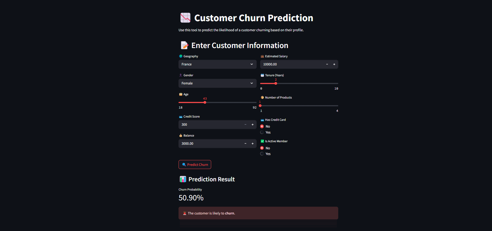

# 📊 Customer Churn Prediction Web App

This project is a **Streamlit-based web application** that predicts the probability of a customer **churning** (leaving a service) using a trained **TensorFlow deep learning model**. It accepts user inputs such as credit score, geography, age, balance, etc., and returns the likelihood of churn along with helpful insights.

---

## 🔍 Objective

Customer retention is key to profitability in industries like banking and telecom. This app provides a **real-time prediction system** where business users can input customer details and get an **immediate risk assessment** of churn—helping guide retention strategies.

---

## 🌟 Key Features

| Feature                            | Description |
|------------------------------------|-------------|
| 🧠 Deep Learning Model             | Trained Keras `.h5` model for binary classification |
| 🧾 Real-time Prediction            | Instant churn prediction based on user input |
| 📥 CSV Export                     | Download prediction and input data |
| 📊 User vs. Average Chart         | Visual bar chart comparing user input with average metrics |
| 🧩 Categorical Feature Encoding   | Uses Label and OneHotEncoding for preprocessing |
| 📐 Feature Scaling                | Applies `StandardScaler` for model input |
| 🎨 Streamlit UI                   | Responsive, clean interface with emojis and icons |
| ✅ Form-based Input               | Organized form layout using `st.columns` |

---

## 🧠 Technologies Used & Explanation

| Tool | Description |
|------|-------------|
| **TensorFlow/Keras** | Trained binary classification model (`model.h5`) to predict churn |
| **Streamlit** | Web framework for rapid UI development |
| **Pandas** | Data manipulation for input handling |
| **scikit-learn** | Used for LabelEncoding, OneHotEncoding, and StandardScaler |
| **Pickle** | Loading saved encoders and scaler |
| **Matplotlib/Streamlit Charts** | Visualization (bar chart for comparison) |

### 🔧 Encoders & Scaler
These are pre-trained preprocessing tools saved as `.pkl` files:
- `label_encoder_gender.pkl` – Converts Gender to numerical labels
- `onehot_encoder_geo.pkl` – One-hot encodes the Geography field
- `scaler.pkl` – StandardScaler for scaling numerical features before model input

---

## 📁 Project Structure

```
churn-prediction-app/
│
├── app.py                        # 🚀 Main Streamlit app
├── model.h5                      # 🤖 Trained Keras model
├── label_encoder_gender.pkl      # 🔠 LabelEncoder for gender
├── onehot_encoder_geo.pkl        # 🌍 OneHotEncoder for geography
├── scaler.pkl                    # 📐 Scaler for input normalization
├── requirements.txt              # 📦 Python dependencies
└── README.md                     # 📘 Project documentation
```

---

## ▶️ How to Run the App

### 1. Clone the Repository
```bash
git clone https://github.com/Amankhan1009/customer-churn-predictor-using-ANN.git
cd customer-churn-predictor-using-ANN
```

### 2. Install Required Packages
```bash
pip install -r requirements.txt
```

### 3. Run the Streamlit App
```bash
streamlit run app.py
```

Open your browser at `http://localhost:8501`.

---

## 📷 App Preview


---

## 🧪 Sample Workflow

1. Enter customer details in the form (e.g., Age, Geography, Balance)  
2. Click **🔍 Predict Churn**  
3. View churn probability along with a recommendation (e.g., "likely to churn")  
4. Download the prediction result as a **CSV file**  
5. Compare user input with **average customer data** in a **visual bar chart**

---

## 📈 Sample Input Features

- **Credit Score** (e.g., 600)  
- **Gender** (Male/Female)  
- **Age**  
- **Tenure** (Years with the company)  
- **Balance**  
- **Number of Products**  
- **Has Credit Card** (0 = No, 1 = Yes)  
- **Is Active Member** (0 = No, 1 = Yes)  
- **Estimated Salary**  
- **Geography** (France, Germany, Spain)

---

## 🚀 Future Enhancements

- 📤 Support **CSV batch upload** to process multiple customer predictions  
- 📈 Add an **interactive dashboard** with churn analytics  
- ☁️ Deploy the app on **Streamlit Cloud / AWS / Heroku**  
- 🔐 Add **authentication** and role-based access (admin vs. user)  
- 📬 Send **churn alerts via email or Slack** to account managers  

---

## 📄 License

This project is open-source and available under the [MIT License](LICENSE).

---

## 🙋‍♂️ Author

**Your Name**  
🔗 [LinkedIn](https://www.linkedin.com/in/md-aman-alam-a04552289/)  
📫 amankhan34356@gmail.com

---

> Made with ❤️ using Streamlit and TensorFlow


> Here is the link for you try it --> https://amankhan-churn-predictor-using-ann.streamlit.app/
